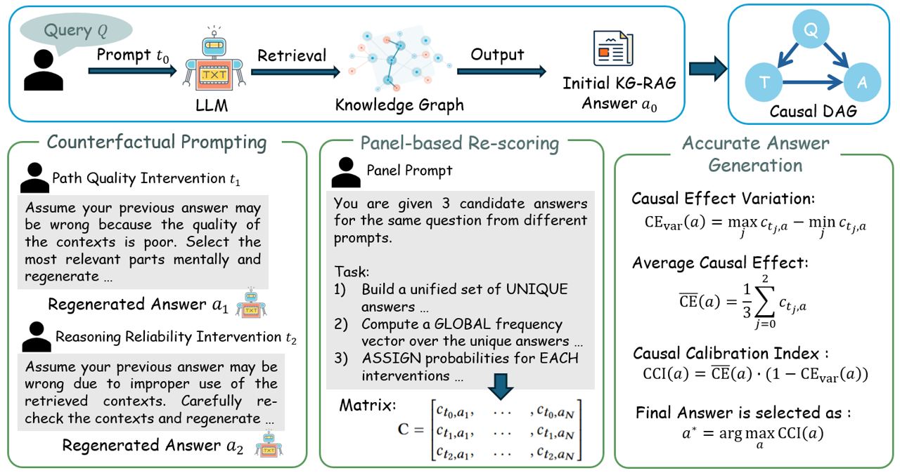

# Ca2KG

<p align="center">
  <strong>Ca2KG</strong>
</p>

<p align="center">
  
  
  
</p>

---

## 🎯 Framework

<p align="center">
  
</p>


---

## 🏗️ Repository Structure

```
kg-rag/
├── 📁 imgs/                     # Figures and visualizations
│   ├── fig_accuracy_under_token_caps_metaqa.png
│   └── fig_answer_token_efficiency_metaqa_committed.png
├── 📁 methods/                 # RAG implementation notebooks
├── 📁 helper/                  # Utility classes and tools
├── 📁 ablation/               # Ablation study experiments
├── 📁 efficiency_experiment/   # Efficiency analysis notebooks
└── 📄 README.md
```

---

## 🚀 Quick Start

<details>
<summary><strong>Installation & Setup</strong></summary>

```bash
# Note: All code in this repository has been successfully tested and executed on Kaggle platform.
# Clone the repository
cd kg-rag

# Launch Jupyter notebooks
jupyter notebook
```

</details>

---

## 🔬 Experiments

| Component | Description | Location |
|-----------|-------------|----------|
| **Core Methods** | RAG implementation notebooks | `methods/` |
| **Ablation Studies** | Component analysis experiments | `ablation/` |
| **Efficiency Analysis** | Performance optimization studies | `efficiency_experiment/` |
| **Helper Tools** | Utility classes and functions | `helper/` |

---

## 📈 Contributions

- ✅ **Lower Calibration Error**: Improved confidence calibration for knowledge-based QA
- ✅ **Higher Accuracy**: Enhanced performance on MetaQA and benchmark datasets  
- ✅ **Efficient Reasoning**: Optimized multi-hop reasoning with reduced computational overhead
- ✅ **Comprehensive Evaluation**: Extensive ablation studies and efficiency analysis


---

<p align="center">
  <sub>Built with ❤️ for advancing knowledge-grounded AI research</sub>
</p>